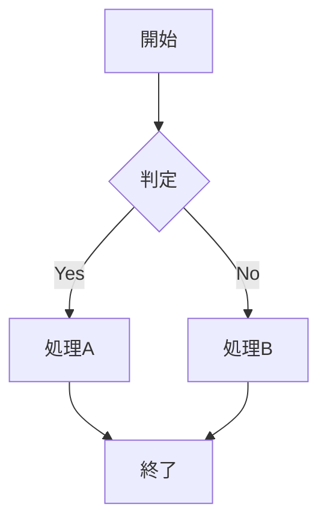
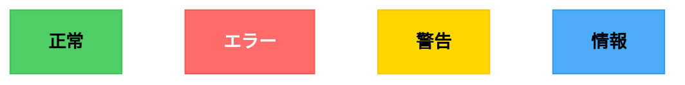
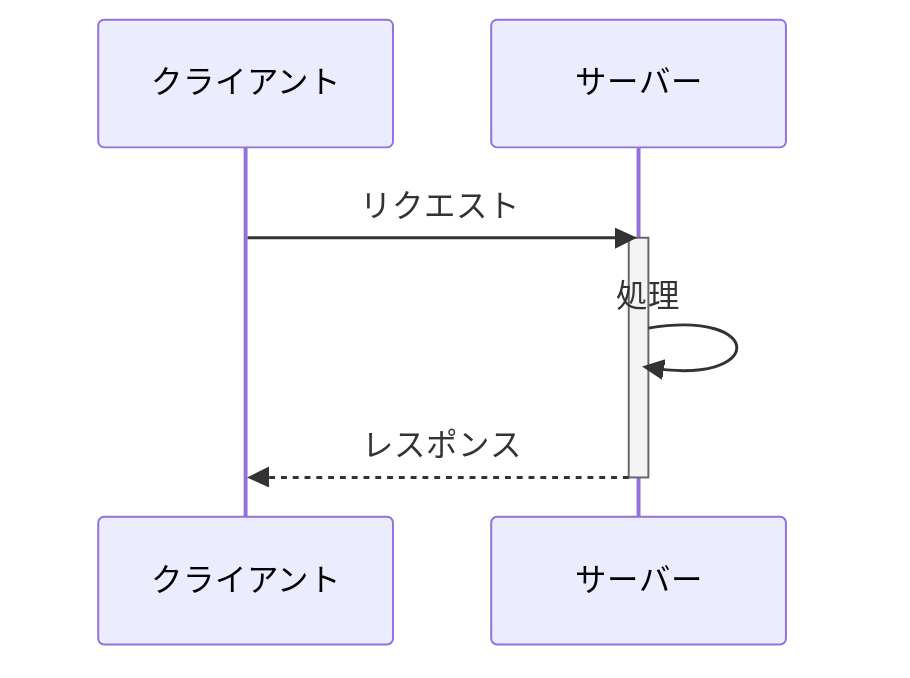
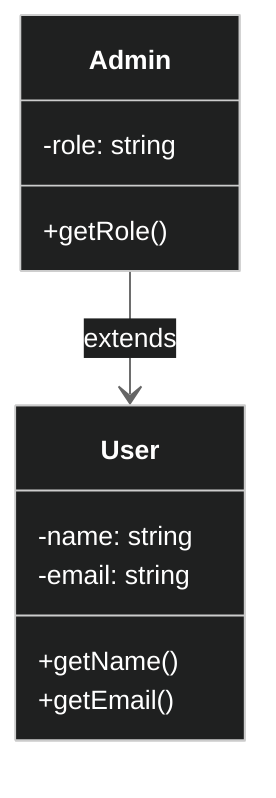
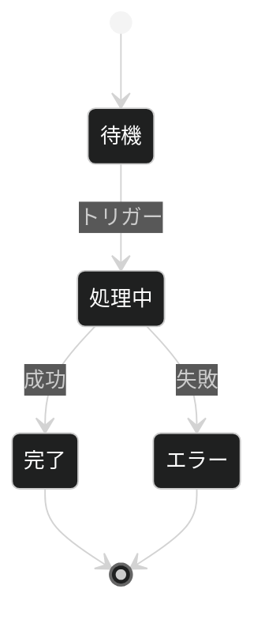
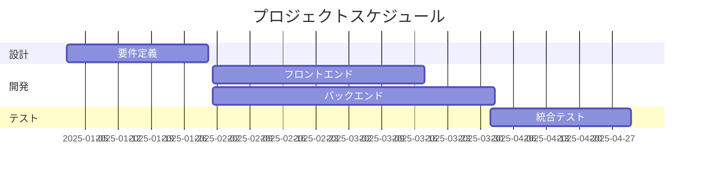
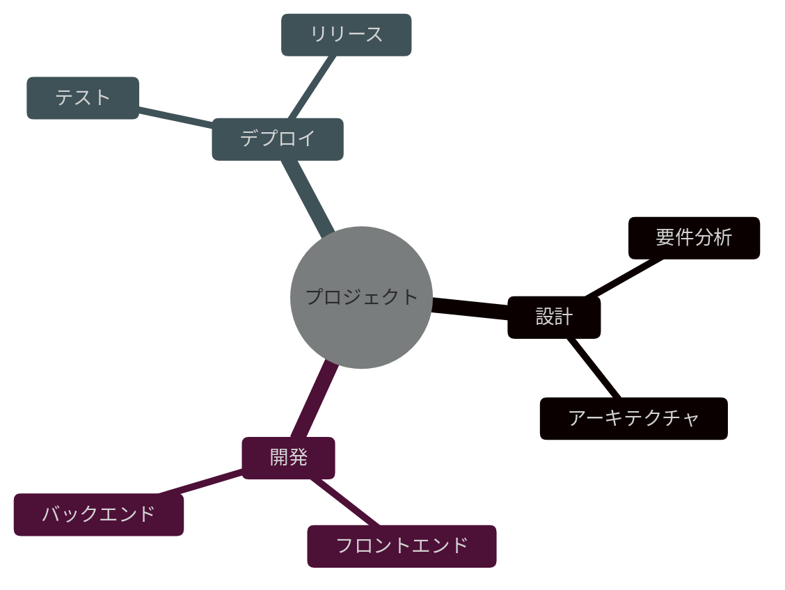
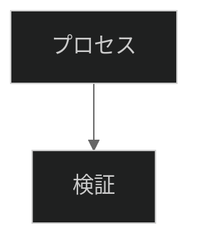

# Mermaid ダークモード図解スキル

Markdown ドキュメント内に Mermaid 図を作成・スタイリングするためのスキル。ダークモード前提で見やすい配色と実用的なテンプレートを提供します。

## 使い方

このスキルは以下のような場面で自動的に活用されます：

- Markdown ドキュメントで図を作成する必要があるとき
- システムアーキテクチャ、フローチャート、プロセス図を視覚化したいとき
- ダークモード環境での図の見づらさを改善したいとき
- 図のスタイルや色設定を最適化したいとき

## カラーパレット（ダークモード向け）

### プライマリカラー
| 用途 | 色コード | RGB | 用途説明 |
|------|--------|-----|---------|
| **アクセント（オレンジ）** | `#FF8C00` | rgb(255, 140, 0) | ハイライト、重要要素、アクション（dotfiles 統一色） |
| **セカンダリオレンジ** | `#FFA500` | rgb(255, 165, 0) | グラデーション、優先度中 |
| **ライトオレンジ** | `#FFB347` | rgb(255, 179, 71) | ボーダー、エンファシス |
| **エラー** | `#FF6B6B` | rgb(255, 107, 107) | 失敗状態、異常系 |
| **成功** | `#51CF66` | rgb(81, 207, 102) | 完了、成功状態、正常系 |
| **警告** | `#FFD700` | rgb(255, 215, 0) | 注意、警告状態 |
| **情報** | `#4DABF7` | rgb(77, 171, 247) | 情報、参考、補足 |

### バックグラウンドカラー
| 用途 | 色コード | RGB | 用途説明 |
|------|--------|-----|---------|
| **ダーク背景** | `#1E1E1E` | rgb(30, 30, 30) | メイン背景（目に優しい黒） |
| **セカンダリ背景** | `#2D2D2D` | rgb(45, 45, 45) | グループ背景、ボックス内部 |
| **テーシャリ背景** | `#3D3D3D` | rgb(61, 61, 61) | ホバー、強調背景 |
| **グリッド線** | `#444444` | rgb(68, 68, 68) | ボーダー、線 |

### テキストカラー
| 用途 | 色コード | RGB | 用途説明 |
|------|--------|-----|---------|
| **プライマリテキスト** | `#FFFFFF` | rgb(255, 255, 255) | ハイコントラスト、強調テキスト |
| **セカンダリテキスト** | `#E8E8E8` | rgb(232, 232, 232) | 通常テキスト、高い可読性 |

---

## よく使う Mermaid スタイル設定

### フローチャート（`flowchart`）

プロセス、意思決定フロー、ワークフロー図に使用。

#### ノード色の指定（成功/エラー/警告）

---

### シーケンス図（`sequenceDiagram`）

API 通信、マイクロサービス間の相互作用、ユーザーインタラクションを表現。

**主要な色設定の役割:**
- `primaryColor`: メッセージ線、ボックス背景
- `primaryBorderColor`: アクティベーションボックス枠線
- `secondBkgColor`: 参加者背景

---

### クラス図（`classDiagram`）

オブジェクト指向設計、データモデル、クラス関係を表現。

---

### 状態図（`stateDiagram`）

ステートマシン、状態遷移、プロセス状態を表現。

---

### ガントチャート（`gantt`）

プロジェクト計画、スケジュール、タイムライン管理。

---

### マインドマップ（`mindmap`）

構想、分析、知識整理、ブレインストーミング。

---

## ダークモード最適化チェックリスト

Mermaid 図を作成する際に確認すべき項目：

- [ ] **テキスト色**: `#E8E8E8` 以上の輝度（黒背景で読みやすい）
- [ ] **ボーダー**: `#FFB347` 以上または `#555555` 以上（黒背景で視認可能）
- [ ] **背景**: 完全な黒 `#000000` ではなく `#1E1E1E` ～ `#2D2D2D`（目が疲れにくい）
- [ ] **コントラスト**: テキストと背景の輝度差が十分（WCAG AA 基準: 4.5:1 以上）
- [ ] **透明度**: `opacity < 0.8` の場合、背景色の選定を再確認
- [ ] **カラー**: dotfiles 統一色（オレンジ系 `#FF8C00` ～ `#FFB347`）を使用

---

## カスタマイズ例

### 企業ブランドカラーを使う場合

---

## トラブルシューティング

### 図が見えない、または見づらい場合

| 問題 | 原因 | 解決策 |
|------|------|--------|
| テキストが見えない | テキスト色が背景と同じ | `primaryTextColor` を `#FFFFFF` に設定 |
| ボーダーが薄い | ボーダーが背景と同じ | `primaryBorderColor` を `#FFB347` 以上に |
| 図全体が見えない | ダークテーマが無効 | 確認環境で `theme: 'dark'` が有効か確認 |
| グラデーションが不自然 | 色数が多すぎる | 単色に統一（`#FF8C00` → `#FF8C00`） |

---

## 参考資料

- **Mermaid 公式テーマ**: https://mermaid.js.org/intro/syntax-reference.html#theming
- **ダークモード向けカラー理論**: https://material.io/design/color/dark-theme.html
- **WCAG コントラスト基準**: https://www.w3.org/WAI/WCAG21/Understanding/contrast-minimum
