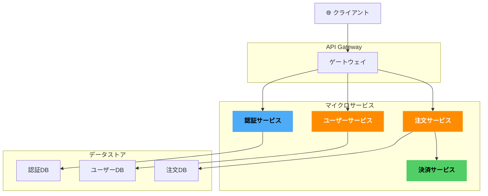
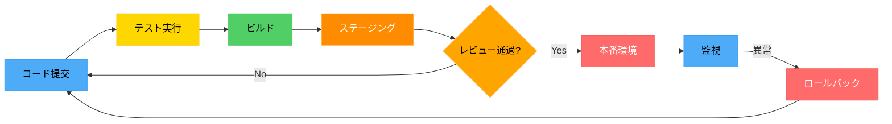
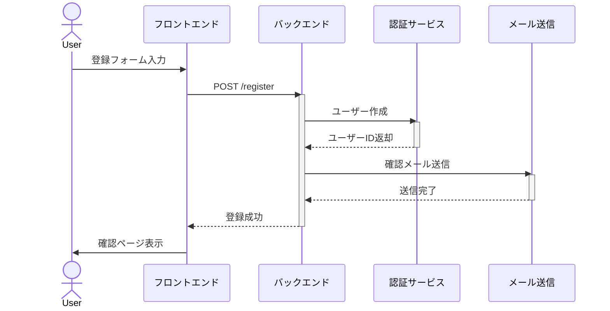
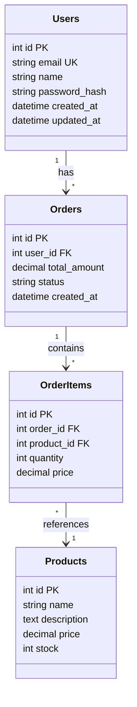
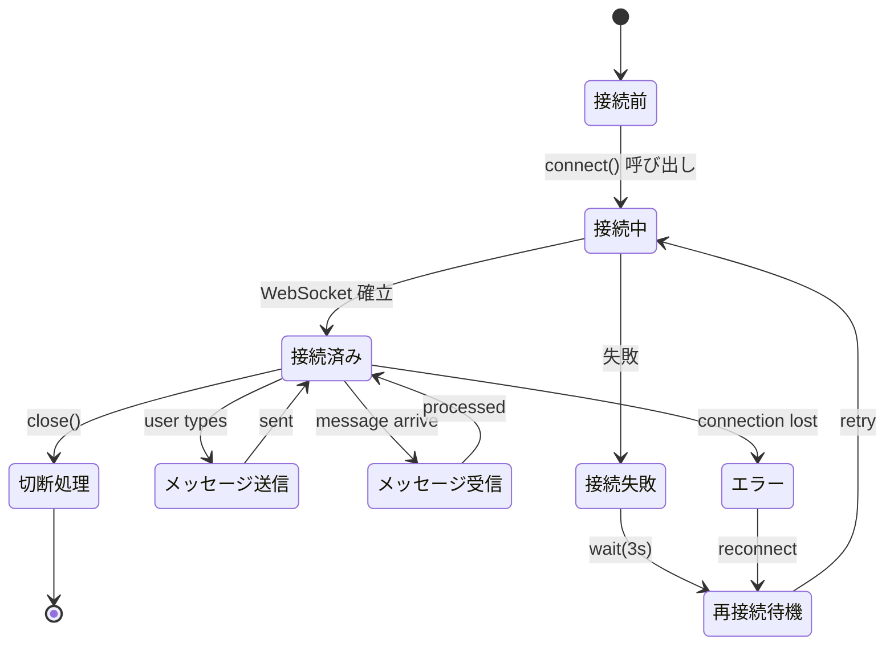
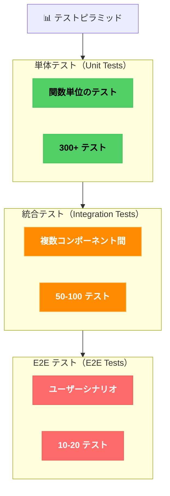
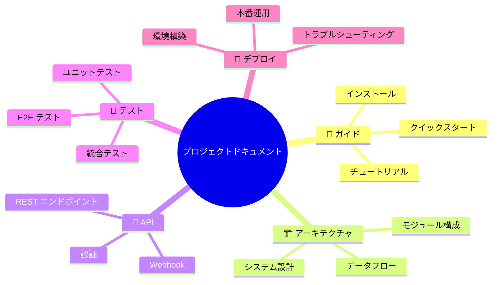

# Mermaid ダークテーマ 実践例集

実装パターン別の Mermaid コード例を集めました。

## システム設計例

### マイクロサービスアーキテクチャ図



### デプロイメントパイプライン



---

## ワークフロー例

### ユーザー登録フロー



### 注文処理フロー

```mermaid
%%{init: {'theme': 'dark', 'themeVariables': {'primaryColor': '#FF8C00', 'primaryBorderColor': '#FFB347'}}}}%%
flowchart TD
  Start["注文開始"]
  CartCheck{"カート内容確認"}
  AddressInput["配送先入力"]
  PaymentInput["支払い情報入力"]
  ReviewOrder["注文確認"]
  ProcessPayment["支払い処理"]
  PaymentSuccess{"支払い成功?"}
  CreateOrder["注文作成"]
  SendEmail["確認メール送信"]
  ShipmentPrepare["発送準備"]
  End["完了"]
  Error["エラー処理"]

  Start --> CartCheck
  CartCheck -->|OK| AddressInput
  CartCheck -->|NG| Error
  AddressInput --> PaymentInput
  PaymentInput --> ReviewOrder
  ReviewOrder --> ProcessPayment
  ProcessPayment --> PaymentSuccess
  PaymentSuccess -->|Yes| CreateOrder
  PaymentSuccess -->|No| Error
  CreateOrder --> SendEmail
  SendEmail --> ShipmentPrepare
  ShipmentPrepare --> End
  Error -->|Retry| Start
  Error -->|Cancel| End

  classDef start fill:#51CF66,stroke:#40C057,color:#000000,font-weight:bold
  classDef process fill:#FF8C00,stroke:#FFB347,color:#FFFFFF,font-weight:bold
  classDef decision fill:#FFA500,stroke:#FFB347,color:#000000,font-weight:bold
  classDef error fill:#FF6B6B,stroke:#EE5A52,color:#FFFFFF,font-weight:bold
  classDef end fill:#4DABF7,stroke:#339AF0,color:#000000,font-weight:bold

  class Start start
  class End end
  class PaymentSuccess decision
  class Error error
  class CartCheck decision
```

---

## データベーススキーマ例

### E-R 図（クラス図で表現）



---

## リアルタイムシステムの状態遷移

### WebSocket チャットの状態管理



---

## テスト戦略図

### テストピラミッド構成



---

## インフラストラクチャ設計

### CI/CD パイプライン（ガントチャート）

```mermaid
%%{init: {'theme': 'dark', 'themeVariables': {'fontSize': '12px'}}}}%%
gantt
  title CI/CD パイプライン実行タイムライン
  dateFormat HH:mm:ss
  axisFormat %H:%M:%S

  section Stage
  git push :s1, 00:00:00, 5s
  lint check :s2, 00:00:05, 10s
  unit test :s3, 00:00:15, 20s
  build docker :s4, 00:00:35, 30s
  push registry :s5, 00:01:05, 10s
  deploy staging :s6, 00:01:15, 15s
  integration test :s7, 00:01:30, 20s
  smoke test :s8, 00:01:50, 10s
  ready :crit, s8, 00:02:00, 1s
```



---

## ドキュメント構造

### プロジェクトドキュメン構成図



---

## カスタマイズテンプレート

任意のテーマカラーで使いたい場合のテンプレート：

```mermaid
%%{init: {
  'theme': 'dark',
  'themeVariables': {
    'primaryColor': '#YOUR_HEX_COLOR',
    'primaryTextColor': '#FFFFFF',
    'primaryBorderColor': '#YOUR_BORDER_HEX',
    'lineColor': '#666666',
    'secondBkgColor': '#2D2D2D',
    'fontSize': '14px'
  }
}}%%
flowchart TD
  A[カスタム色] --> B[自由に変更]
```

ファイル内のすべての `#FF8C00` を目的の色に置換してください。
