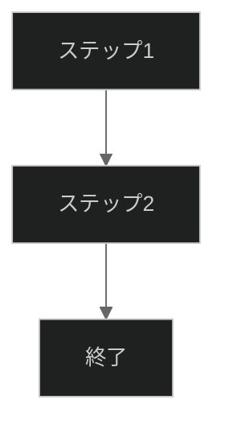
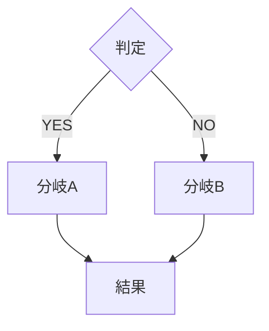
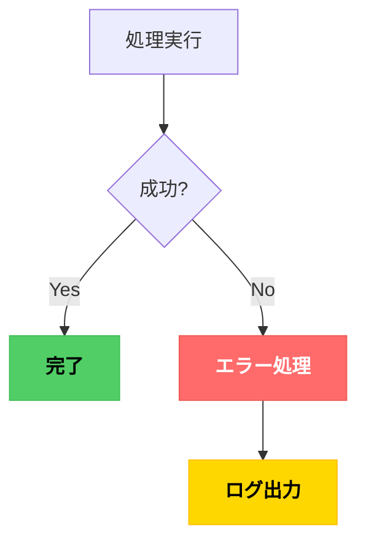
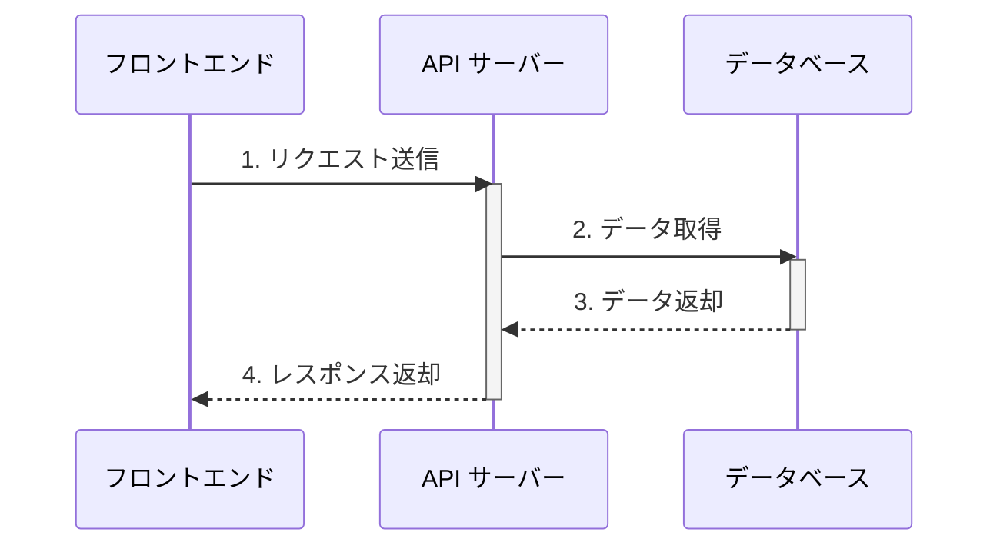
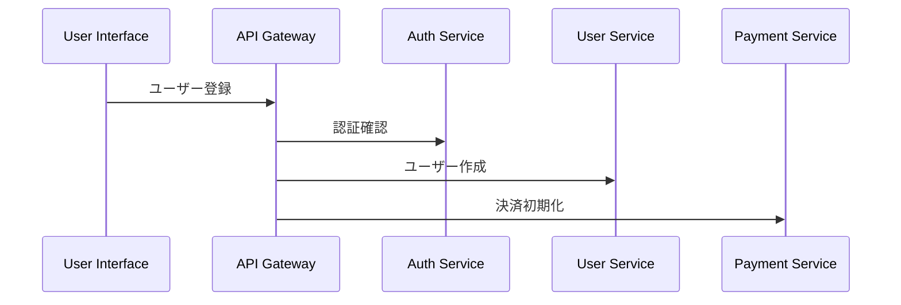
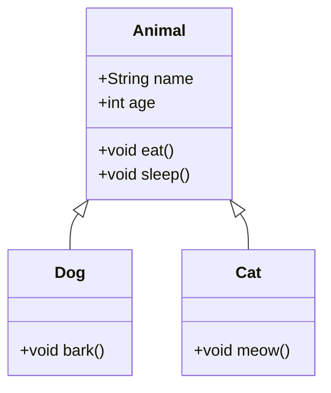
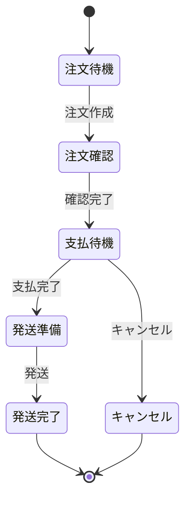
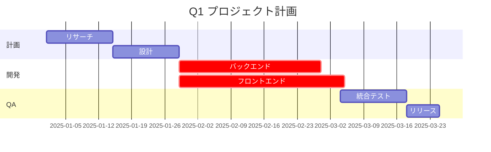
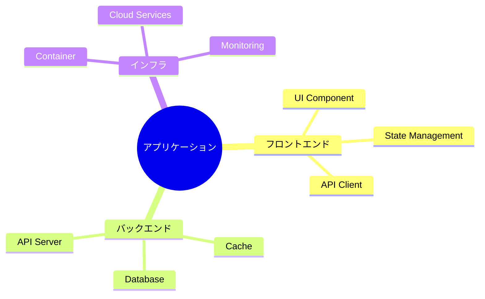

# Mermaid ダークテーマ リファレンスガイド

## Quick Copy-Paste テンプレート

各テンプレートをコピーして、必要に応じて内容を編集してください。

### 最小構成フローチャート



### 意思決定フローチャート



### エラーハンドリングフロー



### API 通信シーケンス



### マイクロサービスアーキテクチャ



### クラス継承関係



### 注文処理のステートマシン



### プロジェクト3ヶ月計画



### アプリケーション構成図（マインドマップ）



---

## よくある質問 (FAQ)

### Q: 色がテンプレートと異なります
**A**: Markdown ビューアーの設定を確認してください。
- VS Code: テーマを「Dark」に設定
- GitHub: 自動ダークモード対応（ブラウザの設定確認）
- その他エディタ: 深色テーマを有効化

### Q: テキストが重なります
**A**: `fontSize` を減らしてください。
```yaml
'fontSize': '12px'  # デフォルト: 16px
```

### Q: グラデーション色を使いたい
**A**: ダークモード向けなので単色推奨。複数色が必要な場合は `classDef` で使い分け。

### Q: 外部スタイルシートを使えますか？
**A**: Mermaid 内の `%%{init: {...}}%%` のみで完結。外部 CSS は Mermaid レンダリングでは反映されません。

### Q: PNG/SVG でエクスポートするときはどうする?
**A**: ブラウザのスクリーンショット機能または Mermaid の CLI でエクスポート。色設定は Mermaid 図に埋め込まれます。

---

## カラー選択フローチャート

ノードの色を決める際：

```
目的は？
├─ 成功・完了状態 → #51CF66 (緑)
├─ エラー・失敗状態 → #FF6B6B (赤)
├─ 警告・注意状態 → #FFD700 (黄)
├─ 情報・参考 → #4DABF7 (青)
└─ 通常・メイン → #FF8C00 (オレンジ) ← dotfiles 統一色
```

---

## テーマ切り替え

### ライトモード（参考用）

```yaml
%%{init: {
  'theme': 'default',
  'themeVariables': {
    'primaryColor': '#FFE5CC',
    'primaryTextColor': '#000000',
    'primaryBorderColor': '#FF8C00',
    'fontSize': '16px'
  }
}}%%
```

> 注: このリポジトリはダークモード前提のため、ライトモードはサポート外です。

---

## パフォーマンス考慮事項

- **大規模フローチャート**: 30 ノード以上は複数図に分割推奨
- **シーケンス図**: 参加者が 10 人以上は複雑度が上がるため、複数図への分割を検討
- **複雑なガントチャート**: 15 タスク以上は描画が遅延することがあるため、期間で分割
