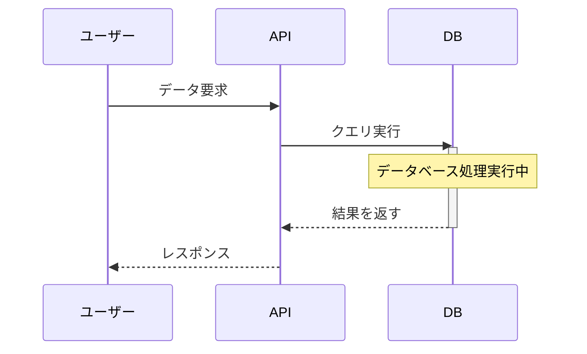
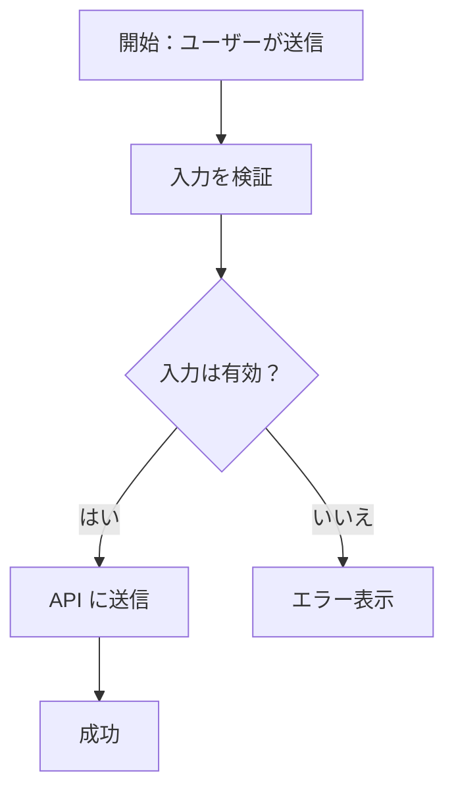
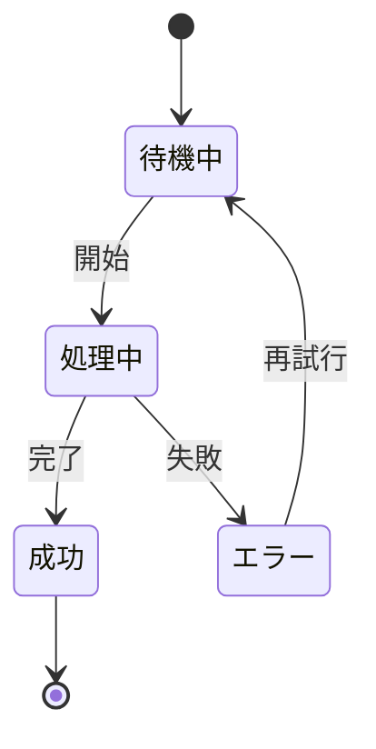
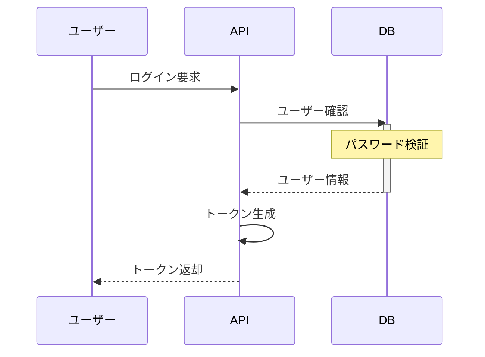
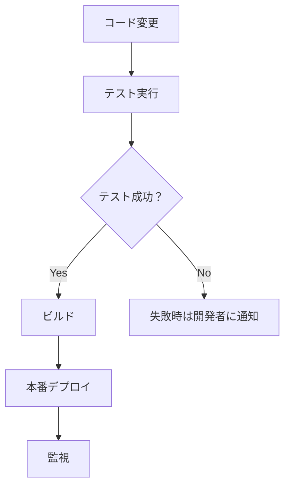
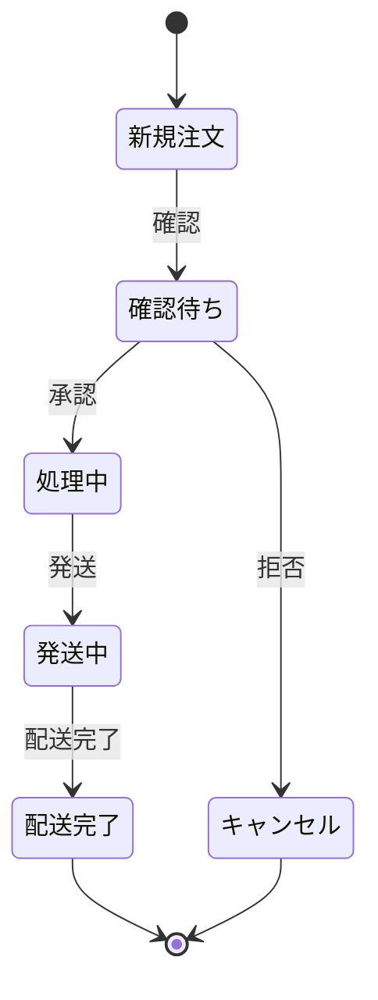
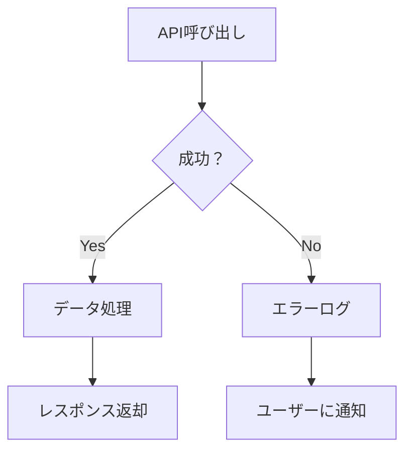
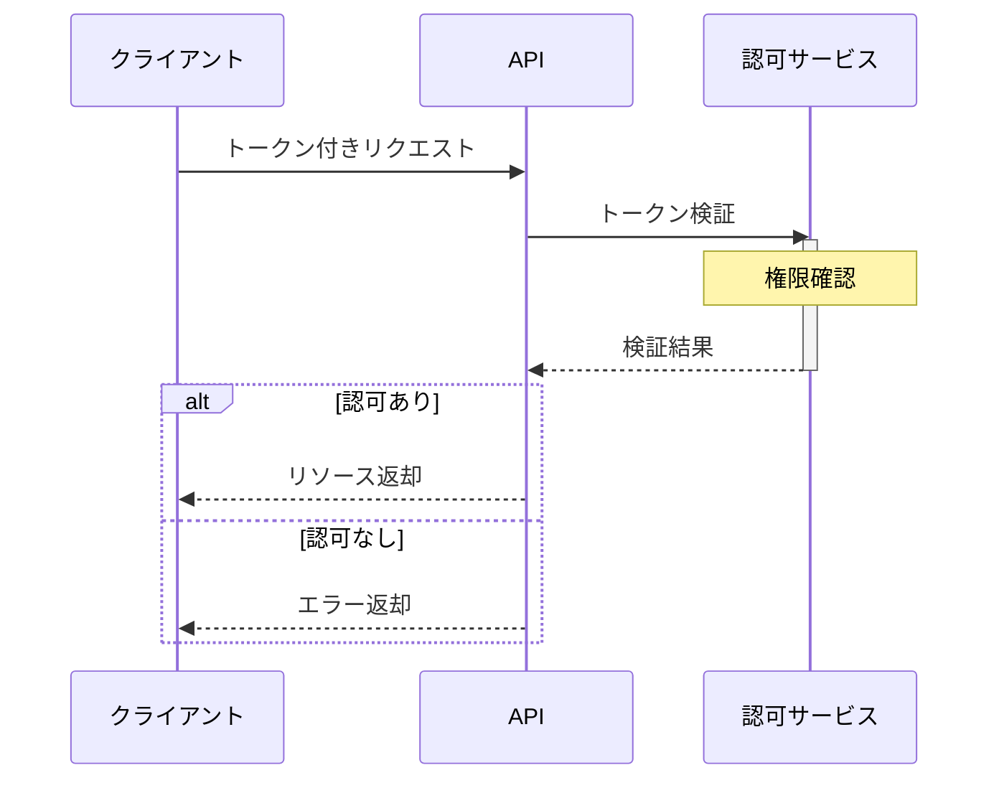

# Mermaid Guardian

## 概要

Mermaid Guardian は、実証済みのベストプラクティスを強制することで、構文的に正しく、確実にレンダリングされる Mermaid 図を作成できるようにサポートします。生成前の事前チェックと生成後の自動修正により、すべてのプラットフォームで信頼性高く図が描画されます。

## 使用方法

| モード | 使う場面 | コマンド例 | 出力内容 |
|--------|---------|----------|--------|
| **pre-check** | 図を生成する前にベストプラクティスを確認したい | `/mermaid-guardian pre-check`<br>[図の概要] | 推奨構成、注意点 |
| **post-check** | 生成された図にエラーがある | `/mermaid-guardian post-check`<br>[Mermaidコード] | 問題検出、修正提案、修正済みコード |
| **fix** | 修正コードだけが欲しい | `/mermaid-guardian fix`<br>[Mermaidコード] | 修正済みコード（説明なし） |

**tip**: 図の複雑さに不安があれば **pre-check** で相談するのが最短です。

## クイックスタート：一般的な図種

### シーケンス図（用途：メッセージフロー、API 相互作用、通信パターン）

**推奨例**:


**避けるべきパターン**:
- ❌ 自己メッセージ（A->>A: 処理）
- ❌ Note、rect、メッセージを複雑に混在
- ❌ 参加者が 4 人以上
- ❌ activation ブロックが深くネストしている

### フローチャート（用途：判定フロー、ワークフロー、アーキテクチャ関係図）

**推奨例**:


**避けるべきパターン**:
- ❌ ノード名が曖昧（「超える」「影響を受ける」）
- ❌ ノード数が 10 個以上
- ❌ エッジラベルが 3 語以上
- ❌ 多くの概念を混在させている

### 状態図（用途：ステートマシン、ライフサイクル管理）

**推奨例**:


## ステップバイステップ：完全なワークフロー

### 1. 図をプランする

Claude に生成を頼む前に：

1. **図種を決める**：sequence, graph, state, class など
2. **スコープを定義**：要素は何個？（目標：シンプルに）
3. **主な関係性を特定**：3～5 個の主要な接続
4. **制限を確認**：この図種で実現可能か？

### 2. 事前チェックをリクエスト

プランを Mermaid Guardian に検証させます：

```
/mermaid-guardian pre-check

図種：sequenceDiagram
参加者：4 人（Client、Server、AuthService、Database）
目的：OAuth2 トークンフローを表示
```

### 3. Claude で生成

検証済みプランを使って Claude に図を生成させます。

### 4. 生成コードをチェック

常に生成結果を検証します：

```
/mermaid-guardian post-check

[生成されたコード]
```

### 5. 必要に応じて反復

エラーが検出された場合：
- 自動修正を受け入れるか
- 図のコンセプトをシンプルにするか
- 別の図種に変更するか

## テンプレートライブラリ

すぐに使えるテンプレート集です。コピペして自分のプロジェクト用に編集できます。

### 認証フロー（sequenceDiagram）



### デプロイワークフロー（graph TD）



### 注文ステートマシン（stateDiagram-v2）



### エラーハンドリングフロー（graph TD）



### 認可フロー（sequenceDiagram）



## 検証チェックリスト（簡易版）

出力後は以下をチェック。詳細は [reference.md](reference.md) を参照：

**すべての図**
- [ ] 見た目が複雑すぎないか
- [ ] ラベルが明確か

**sequenceDiagram**
- [ ] 参加者が 4 人以下か
- [ ] 自己メッセージ（A->>A）がないか

**graph TD/LR**
- [ ] ノード数が 10 個以下か
- [ ] ノード名が 1～3 語か

**stateDiagram**
- [ ] 状態数が 7 個以下か

## エラーが出たときは

詳細なトラブルシューティングは **[reference.md](reference.md)** を参照。
エラーメッセージ→原因→修正方法をまとめています。

## 出力形式

**事前チェック出力**:
```
✅ ベストプラクティスチェック
- [推奨 1]
- [推奨 2]
- 生成準備完了！
```

**事後チェック出力**:
```
❌ 問題検出：3 件

1. [問題名]
   問題：[何が正しくないか]
   修正：[修正後コード]

2. [問題名]
   ...

---
✅ 修正済みコード：
[完全な修正後の図]
```

## 重要なコツ

1. **迷ったときはシンプルに**
   - 参加者やノード数が少ない = エラーが少ない

2. **内部処理には `Note over` を使う**
   - ❌ A->>A: 内部処理（自己メッセージ）
   - ✅ Note over A: 内部処理

3. **ダークモード対応を確認**
   - GitHub などダークモードで見た時に読みやすいか確認

---

## クイックリファレンスカード

| 図種 | 最大要素数 | 最大参加者数 | 最適な用途 | 避けるべき点 |
|------|-----------|-----------|----------|-----------|
| sequenceDiagram | 20 相互作用 | 4 | メッセージフロー | 自己メッセージ |
| graph (TD/LR) | 10 ノード | N/A | ワークフロー、ツリー | 複雑な循環 |
| stateDiagram | 7 状態 | N/A | ステートマシン | 曖昧な遷移 |
| classDiagram | 10 クラス | N/A | OOP 設計 | 深い階層 |

---

## フィードバック＆貢献

Guardian ルールに漏れているパターンを見つけたら報告してください。

報告対象のエラーパターン：
- Mermaid からのエラーメッセージ
- 問題を再現する最小コード
- 期待されるレンダリング結果
